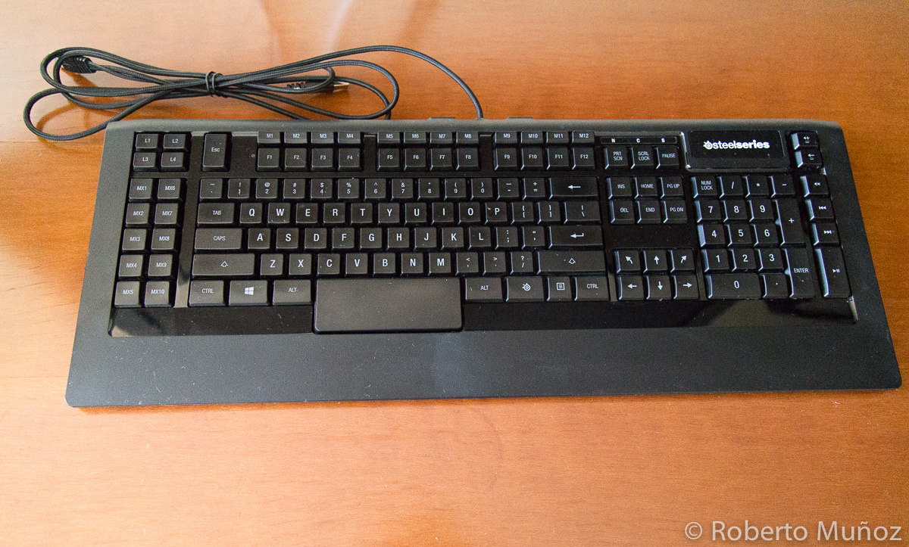
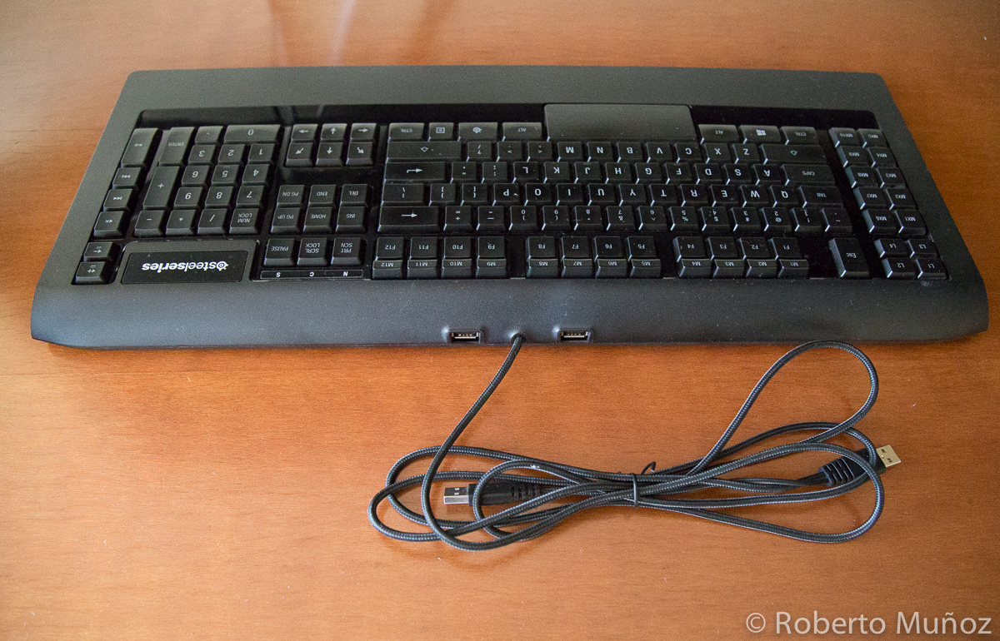
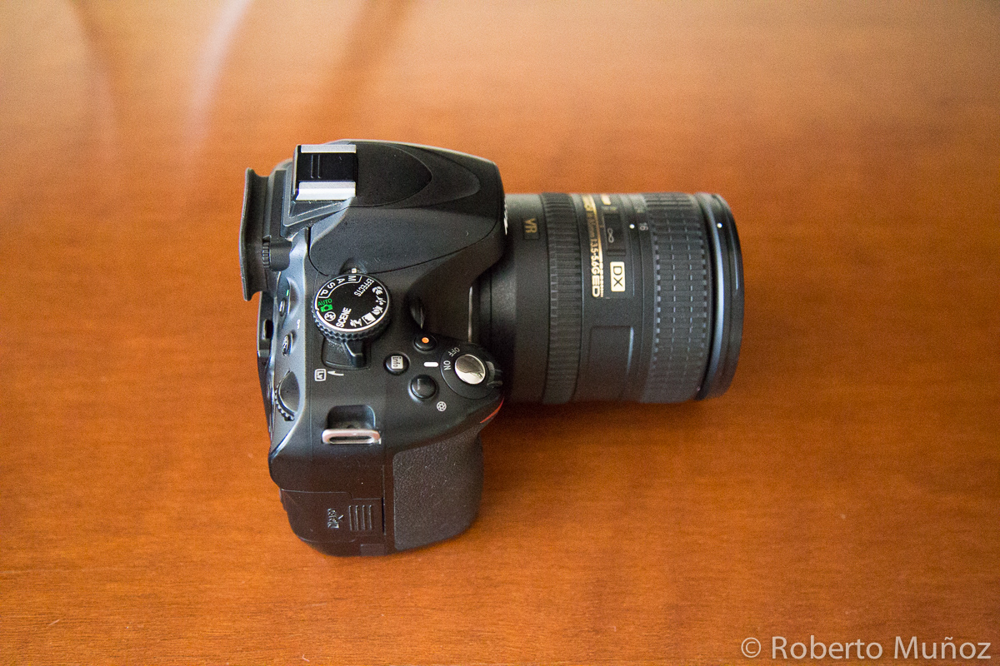
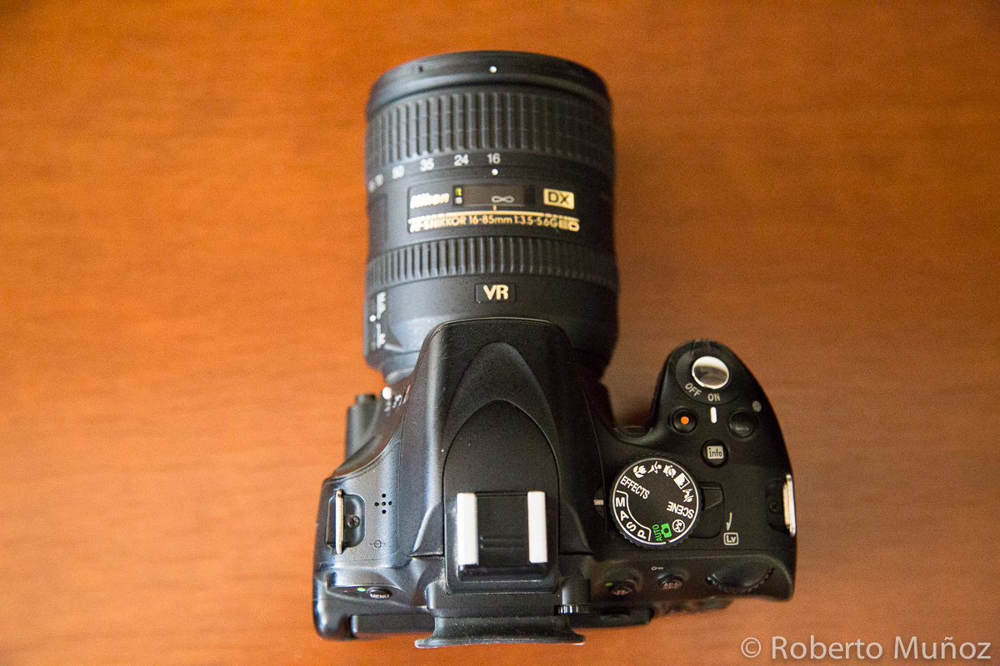
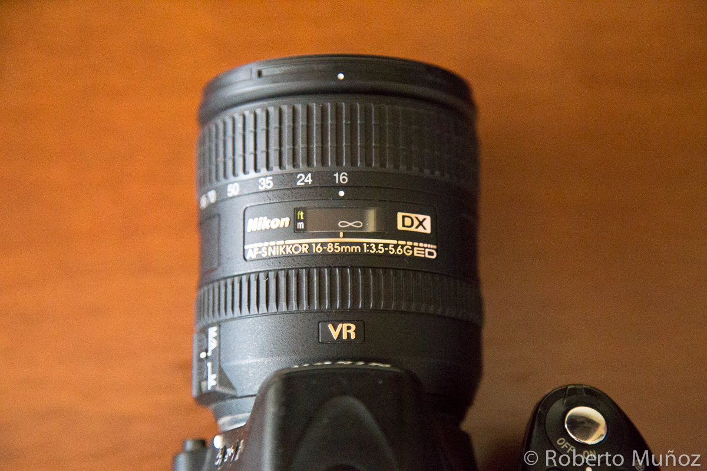

Estimados(as),

Por motivos de viaje he decidido poner a la venta un teclado gamer marca Steelseries y una cámara fotográfica Nikon D5100.

El teclado fue comprado en PC Factory hace 6 meses y usado sólo en un par de ocasciones. El valor pagado por el producto fue de 40.000 pesos. La descripción completa en el siguiente link <https://www.pcfactory.cl/producto/15355-Teclado..Gamer.Apex.Raw.Membrana.Ingls.USB>

La cámara fotográfica fue comprada en Alemania en Septiembre del 2013 y fue usada por de manera exclusiva por mi durante dos años (valor referencial de 400 USD). La cámara viene equipada con un lente Nikon varifocal de 16-85 mm 1:3.5-5.6 formato DX que ofrece gran nitidez de imagen (valor referencial de 700 USD, <http://www.nikonusa.com/en/nikon-products/product/camera-lenses/af-s-dx-nikkor-16-85mm-f3.5-5.6g-ed-vr.html>), un filtro polarizador (valor referencial de 50 USD) y un control remoto (valor referencial de 10 USD). El valor pagado por el set fue de 1.150,00 USD equivalentes a 760.000 pesos. La descripción completa de la cámara en el siguiente link <http://www.nikonusa.com/en/nikon-products/product-archive/dslr-cameras/d5100.html>

El precio de venta del teclado es de **30.000 pesos**.
El precio de venta del set de la cámara Nikon es de **400.000 pesos**.

